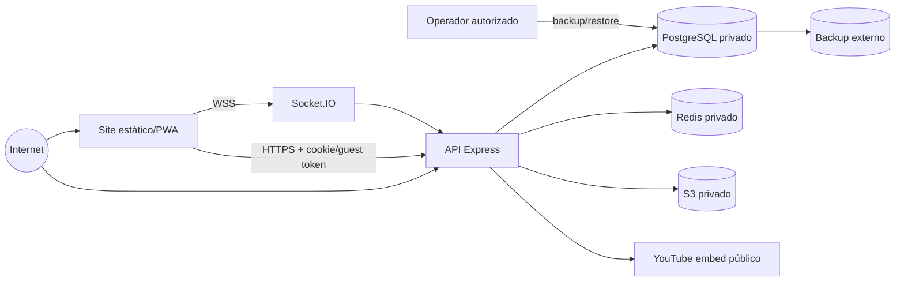
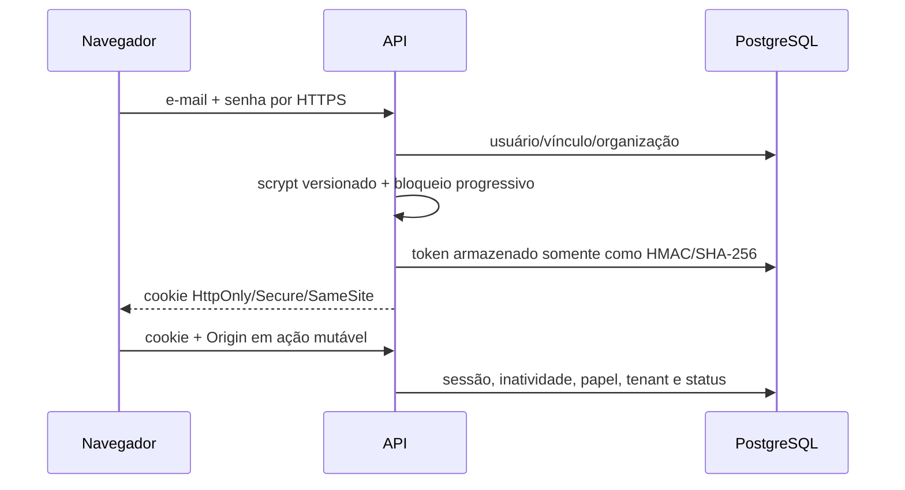
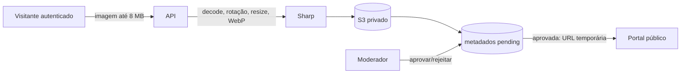

# Fluxos de dados

```mermaid
flowchart LR
  Internet((Internet)) --> CDN[Site estático/PWA]
  Internet --> API[API Express]
  CDN -->|HTTPS + cookie/guest token| API
  CDN -->|WSS| WS[Socket.IO]
  WS --> API
  API --> PG[(PostgreSQL privado)]
  API --> REDIS[(Redis privado)]
  API --> S3[(S3 privado)]
  API --> YT[YouTube embed público]
  OPS[Operador autorizado] -->|backup/restore| PG
  PG --> BACKUP[(Backup externo)]
```

## Autenticação administrativa

```mermaid
sequenceDiagram
  participant B as Navegador
  participant A as API
  participant D as PostgreSQL
  B->>A: e-mail + senha por HTTPS
  A->>D: usuário/vínculo/organização
  A->>A: scrypt versionado + bloqueio progressivo
  A->>D: token armazenado somente como HMAC/SHA-256
  A-->>B: cookie HttpOnly/Secure/SameSite
  B->>A: cookie + Origin em ação mutável
  A->>D: sessão, inatividade, papel, tenant e status
```

## Upload de mídia atual

```mermaid
flowchart LR
  G[Visitante autenticado] -->|imagem até 8 MB| API
  API -->|decode, rotação, resize, WebP| SHARP[Sharp]
  SHARP --> S3[(S3 privado)]
  S3 --> META[(metadados pending)]
  MOD[Moderador] -->|aprovar/rejeitar| META
  META -->|aprovada: URL temporária| P[Portal público]
```

Lacuna: ainda não há antivírus/quarentena externa; será implementada na fase de arquivos.
