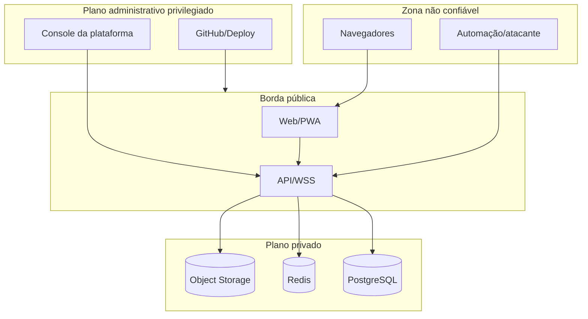

# Fronteiras de confiança

1. **Internet → site estático:** todo parâmetro, URL e conteúdo é não confiável.
2. **Navegador → API:** autenticação não implica autorização; cada objeto deve ser limitado por tenant, papel e módulo.
3. **Socket → API:** eventos são não confiáveis e precisam repetir autenticação/autorização.
4. **API → PostgreSQL:** somente queries parametrizadas; a aplicação atual é a principal barreira de tenant até RLS.
5. **API → Redis:** Redis não é fonte permanente; chaves futuras devem possuir namespace de ambiente e tenant.
6. **API → S3:** bucket privado; chaves nunca fornecidas pelo cliente; URL temporária somente após autorização/publicação.
7. **Plataforma interna → clientes:** é a fronteira de maior privilégio; exige MFA/step-up, auditoria e sessão curta.
8. **CI/deploy → produção:** artefato e secrets são confiados apenas após checks e aprovação humana.
9. **Produção → backup:** a credencial de produção não deve conseguir apagar todas as cópias externas.
10. **Fornecedor → sistema:** indisponibilidade, comprometimento e alteração contratual são riscos externos.

